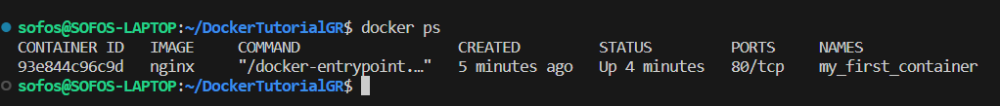

<h1 align="center">
<br>

<br>
<strong> A GR Docker Tutorial for Beginners </strong>
</h1>

<h3 align="center">
<i>This repository serves as a beginner's tutorial on Docker in Greek. It provides concise guidance on Docker fundamentals, including the creation of Dockerfiles, building images, running containers and sharing images.</i>
</h3>
<br>

[![License][license-badge]][license-link]

# 🚩 Table of Contents
* [Εισαγωγή στο Docker](#εισαγωγή-στο-docker)
* [Εγκατάσταση του Docker](#εγκατάσταση-του-docker)
* [Βασικές εντολές Docker](#βασικές-εντολές-docker)
* [Δημιουργία Dockerfile](#dockerfile-creation)
* [Κατασκευή Εικόνας Docker](#docker-image-creation)
* [Διαχείριση Docker Images](#docker-images)
* [Docker Compose](#docker-compose)
* [Κατασκευή Docker Volume](#docker-volume-creation)
* [Διαχείριση Volumes](#docker-volumes)
* [Προχωρημένες λειτουργίες Docker](#προχωρημένες-λειτουργίες-docker)
* [Case Study](#case-study)


# Εισαγωγή στο Docker
##  Τι είναι το Docker 
Το Docker αποτελεί μια πλατφόρμα ανοικτού κώδικα που παρέχει ένα σύνολο εργαλείων για τον αυτοματισμό της διαδικασίας ανάπτυξης, δοκιμής, εγκατάστασης, ρύθμισης και εκτέλεσης εφαρμογών μέσω της χρήσης ελαφρών(lightweight), φορητών εικονικών μηχανών, γνωστών ως "**containers**".
Πρόκειται για πλήρως αυτόνομα περιβάλλοντα εκτέλεσης(runtime environments) που ενθυλακώνουν την εφαρμογή και όλες τις απαραίτητες εξαρτήσεις της. Παρέχουν απομόνωση, εξασφαλίζοντας ότι η εφαρμογή εκτελείται σε ένα φορητό και ανεξάρτητο 
περιβάλλον, εξαλείφοντας με αυτόν τον τρόπο πιθανά προβλήματα ασυμβατότητας συστημάτων.

## Βασικά στοιχεία
1. **Images**
* Αποτελούν εκτελέσιμα πακέτα που περιέχουν την εφαρμογή, τις εξαρτήσεις και τις "οδηγίες" εκτέλεσης.
* Οι εικόνες είναι ανεξάρτητες και μπορούν να κοινοποιούνται και να επαναχρησιμοποιούνται.
2. **Dockerfile**
* Αρχείο κειμένου που περιγράφει τα βήματα για τη δημιουργία μιας εικόνας Docker.
* Περιέχει οδηγίες για την επιλογή της εικόνας βάσης, την εγκατάσταση εξαρτήσεων, τον καθορισμό του working directory και του σημείου εκκίνησης(entrypoint) κ.ά.
3. **Docker Compose**
* Επιτρέπει τον ορισμό και τη διαχείριση πολλαπλών containers ως μέρος μιας εφαρμογής.
* Καθορίζει τις ρυθμίσεις, τις εξαρτήσεις και τις υπηρεσίες ενός περιβάλλοντος εκτέλεσης μέσω ενός YAML αρχείου. 
4. **Volumes**
* Διατηρούν και διαχειρίζονται δεδομένα μεταξύ του host machine και των containers.
* Χρησιμοποιούνται για την αποφυγή απώλειας δεδομένων κατά την ανανέωση ή αντικατάσταση ενός container.
5. **Networks**
* Επιτρέπουν την επικοινωνία μεταξύ διαφορετικών containers.
* Ορίζουν περιβάλλοντα δικτύου για την ασφαλή επικοινωνία μεταξύ διαφορετικών εφαρμογών.
6. **Docker Hub**
* Διαδικτυακή υπηρεσία που παρέχει την δυνατότητα αποθήκευσης, διαμοιρασμού και αναζήτησης εικόνων Docker.


# Εγκατάσταση του Docker

Για την εγκατάσταση του Docker engine στο προσωπικό σας μηχάνημα, θα πρέπει να ακολουθήσετε συγκεκριμένα βήματα, κατάλληλα προσαρμοσμένα στο λειτουργικό σύστημα που χρησιμοποιείτε.

* Αναλυτικές οδηγίες εγκατάστασης για **Windows**: [Docker Desktop for Windows][windows-link]
* Αναλυτικές οδηγίες εγκατάστασης για **Linux**(Ubuntu distr.): [Docker Desktop for Linux][linux-link]
* Αναλυτικές οδηγίες εγκατάστασης για **macOS**: [Docker Desktop for macOS][macos-link] 

Μόλις ολοκληρώσετε την εγκατάσταση του Docker, ελέγξτε ότι η τελευταία έγινε επιτυχημένα εκτελώντας την εντολή:
```bash
$ docker run hello-world
```
Προκειμένου να ελέγξετε την έκδοση του Docker που έχετε πλέον στο μηχάνημά σας, μπορείτε να χρησιμοποιήσετε την εντολή:
```bash
$ docker version
```
> [!WARNING]
> Επειδή το Docker χρησιμοποιεί ***Unix socket*** το οποίο ανήκει στον root χρήστη του μηχανήματος, η χρήση του Docker CLI(Command Line) απαιτεί την
χρήση του προσδιορισμού ***sudo***. Σε περίπτωση που κάτι τέτοιο δεν είναι επιθυμητό, χρειάζεται να προσθέσετε τον αντίστοιχο
χρήστη σε ένα ***Unix group*** με την ονομασία **docker**. Η παραπάνω διαδικασία μπορεί να διεκπεραιωθεί μέσω της εκτέλεσης των παρακάτω εντολών:

```bash
# Δημιουργία του group docker(αν δεν υπάρχει ήδη)
$ sudo groupadd docker

# Προσθήκη του χρήστη στο group docker
$ sudo usermod -aG docker $USER

# Ενεργοποίηση αλλαγών για τα groups κάνοντας relogin και ελέγχος χρήσης docker χωρίς sudo
$ docker run hello-world
``` 
> [!CAUTION]
> Η εισαγωγή ενός χρήστη στο group Docker, του αναθέτει αυτόματα δικαιώματα επιπέδου διαχειριστή(root privileges). Επομένως, απαιτείται ιδιαίτερη προσοχή στους χρήστες που εισέρχονται στο συγκεκριμένο group.

> [!NOTE]
> Παρέχεται και η δυνατότητα χρήσης του Docker σε rootless mode. 
Περισσότερες πληροφορίες μπορούν να αντληθούν από το επίσημο documentation του [Docker][Docker-rootless].


# Βασικές Εντολές Docker
***docker pull [desired image]***: Kατεβάζει την επιθυμητή εικόνα από το αντίστοιχο Docker registry(Docker Hub) και την αποθηκεύει στο σύστημα του χρήστη. Για παράδειγμα, εκτελώντας την εντολή:
```bash 
$ docker pull nginx 
```
κατεβάζουμε και αποθηκεύουμε την εικόνα nginx στο μηχάνημά μας. 

***docker images***: Εμφανίζει πληροφορίες σχετικές με τις εικόνες Docker που έχει αποθηκεύσει ο χρήστης στο σύστημά του. Εάν, νωρίτερα εκτελέσατε την εντολή αποθήκευσης της εικόνας nginx, τότε εκτελώντας την εντολή:
```bash 
$ docker images
```
θα πρέπει να λάβετε ως αποτέλεσμα μία λίστα με μία ή περισσότερες εικόνες(εάν έχετε ήδη και άλλες εικόνες αποθηκευμένες στο μηχάνημά σας), μεταξύ των οποίων περιλαμβάνεται και αυτή του Nginx. 

***docker run [OPTIONS] IMAGE[:TAG] [COMMAND] [ARG...]***: Χρησιμοποιείται για την δημιουργία ενός container βάσει μιας συγκεκριμένης εικόνας. Αν επιθυμείται ο καθορισμός επιπλέον επιλογών, όπως το αν το container θα εκτελεστεί σε background ή interactive κατάσταση ή ο ορισμός συγκεκριμένων θυρών, παρέχεται η δυντότητα προσθήκης των επιλογών αυτών μετά το όνομα της εικόνας. Για παράδειγμα, εκτελώντας την εντολή:
```bash 
$ docker run -d --name my_first_container -p 8080:80 nginx 
```
 δημιουργούμε ένα container που ονομάζεται ***my_first_container*** και χρησιμοποιούμε το flag **-d** προκειμένου το container να εκτελείται στο background, χωρίς να βλέπουμε το αποτέλεσμα πιθανής εξόδου στην οθόνη και το flag **-p 8080:80** προκειμένου να συνδέσουμε τη θύρα 8080 του τοπικού συστήματός μας με τη θύρα 80 του container.

***docker ps***: Εμφανίζει μία λίστα με τα ενεργά containers μαζί με πληροφορίες για αυτά, όπως το container ID, το όνομα, την κατάσταση του container, τις πόρτες που χρησιμοποιεί κ.ά.
Για παράδειγμα, εκτελώντας, στο προσωπικό μας μηχάνημα την εντολή:
```bash 
$ docker ps 
```
θα λάβουμε ως επιστροφή μία λίστα όπως η παρακάτω:
<figure markdown="1" style="display:flex;align-items:center;flex-direction:column;padding:2vh;">

<figcaption style="text-align:center;"><i>Figure 1</i></figcaption>
</figure>

Παρατηρούμε πως έχουμε ένα ενεργό container(πρόκειται για εκείνο που δημιουργήσαμε νωρίτερα), το οποίο στηρίζεται στην εικόνα του **Nginx** και "ακούει" στην θύρα 80.

***docker ps -a***: Εμφανίζει μία λίστα με όλα τα containers του συστήματος του χρήστη μαζί με τις αντίστοιχες πληροφορίες τους.

***docker stop [OPTIONS] CONTAINER [CONTAINER...]***: Χρησιμοποιείται για να σταματήσει ένα ενεργό container. Όταν εκτελεστεί αυτή η εντολή, το Docker στέλνει ένα σήμα(SIGTERM) στις διεργασίες που τρέχουν εντός του container, προκειμένου να προετοιμαστούν για τον τερματισμό τους. Αν η μία από τις διαδικασίες αυτές δεν τερματίσει εθελοντικά, τότε έπειτα από ένα χρονικό όριο, το Docker στέλνει ένα SIGKILL για να την εξαναγκάσει να τερματίσει. Με άλλα λόγια, η εντολή docker stop σταματά ενα container, επιτρέποντάς του να ολοκληρώσει τις εκκρεμότητές του πριν τεθεί σε ανενεργή κατάσταση. Για παράδειγμα, εκτελώντας την εντολή:
```bash 
$ docker stop my_first_container 
```
  σταματά το container ***"my_first_container"*** και τίθεται σε ανενεργή κατάσταση. Η ανενεργή κατάσταση του container μπορεί να επιβεβαιωθεί μέσω της εκτέλεσης της εντολής **docker ps -a**.


***docker start [OPTIONS] CONTAINER [CONTAINER...]***: Χρησιμοποιείται για την εκκίνηση ενός προηγουμένως δημιουργημένου, αλλά σταματημένου container. Όταν ένα container τερματίζεται(σταματημένο), τότε σταματά να εκτελείται και έτσι δεν καταναλώνει πόρους του συστήματος. Η εντολή docker start επανεκκινεί το container, επιτρέποντάς του να να εκκινήσει ξανά την εκτέλεσή του. Για παράδειγμα, εκτελώντας την εντολή:
```bash 
$ docker start my_first_container 
```
εκκινείται το container ***"my_first_container"*** και τίθεται σε ενεργή κατάσταση. Η ενεργή κατάσταση του container μπορεί να επιβεβαιωθεί μέσω της εκτέλεσης της εντολής **docker ps**.

***docker exec [OPTIONS] CONTAINER COMMAND [ARG...]***: Χρησιμοποιείται για την εκτέλεση εντολών εντός ενός ενεργού container. Επιτρέπει έτσι στους χρήστες να εκτελούν εντολές ή να αλληλεπιδρούν με το εσωτερικό περιβάλλον ενός container χωρίς να χρειάζεται να "εισέλθουν" σ'αυτό πλήρως. Για παράδειγμα, εκτελώντας την εντολή:
```bash 
$ docker exec my_first_container nginx -v
```
λαμβάνουμε την έκδοση του Nginx server που εκτελείται μέσα στο container ***"my_first_container"***. 

***docker attach [OPTIONS] CONTAINER***: Χρησιμοποιείται για την σύνδεση του χρήστη στο τερματικό ενός ενεργού container, επιτρέποντάς την απευθείας επικοινωνία του με το περιβάλλον εκτέλεσης του container. Για παράδειγμα, εκτελώντας την εντολή:
```bash 
$ docker attach my_first_container nginx -v
```
εισερχόμαστε στο τερματικό περιβάλλον του container ***"my_first_container"*** και έτσι μπορούμε να εκτελέσουμε εντολές απευθείας σε αυτό. 

> [!IMPORTANT]
Η εντολή **docker attach** συνδέει το τρέχον (host) τερματικό με το τερματικό του container και δεν δημιουργεί ένα νέο τερματικό. Αυτό σημαίνει ότι αν ο χρήστης κλείσει το τρέχον τερματικό,η σύνδεση με το τερματικό του container θα τερματιστεί επίσης.

***docker inspect [OPTIONS] NAME|ID [NAME|ID...]***: Επιστρέφει ένα JSON αντικείμενο που περιέχει λεπτομερείς πληροφορίες για ένα ή περισσότερα αντικείμενα Docker, όπως είναι containers, images, networks, και volumes. 

***docker logs [OPTIONS] CONTAINER***: Χρησιμοποιείται για την εμφάνιση των logs ενός ενεργού ή πρόσφατα τερματισμένου container.

***docker rm [OPTIONS] CONTAINER [CONTAINER...]***: Χρησιμοποιείται για την διαγραφή ενός ή περισσότερων containers που έχουν τερματιστεί από το σύστημα. Χρησιμοποιείται, επομένως, για την αφαίρεση των container instances που δεν χρειάζεται ο χρήστης πλέον. Για παράδειγμα, εκτελώντας την εντολή:
```bash 
$ docker rm my_first_container 
```
θα διαγράψουμε το container με το όνομα **"my_first_container"**. Εάν θέλουμε να διαγράψουμε περισσότερα από ένα container, τοποθετούμε τα ονόματά τους ως επιπλέον ορίσματα. Η διαγραφή του container μπορεί να επιβεβαιωθεί μέσω της εκτέλεσης της εντολής **docker ps**.

> [!TIP]
Χρησιμοποιώντας το flag -f στην εντολή **docker rm -f my_first_container** το container ***"my_first_container"*** θα διαγραφεί ακόμη και αν είναι ενεργό, αλλά αυτό ενδεχομένως να οδηγήσει σε απώλεια δεδομένων ή προβλήματα, αν δεν έχει εκτελεστεί προηγουμένως κατάλληλος έλεγχος.


<!-- MARKDOWN LINKS & IMAGES -->
[license-badge]: https://img.shields.io/badge/License-MIT-blue.svg
[license-link]: https://github.com/DmMeta/ChordSeek/blob/main/LICENSE
[windows-link]:https://docs.docker.com/desktop/install/windows-install/
[linux-link]: https://docs.docker.com/engine/install/ubuntu/
[macos-link]: https://docs.docker.com/desktop/install/mac-install/
[docker-rootless]: https://docs.docker.com/engine/security/rootless/
