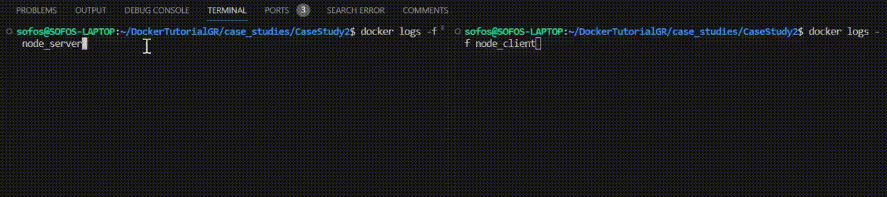
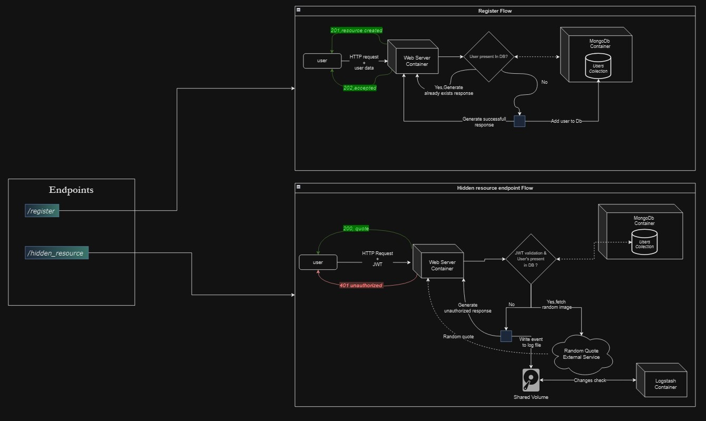

<h1 align="center">
<br>

<br>
<strong> A GR Docker Tutorial for Beginners </strong>
</h1>

<h3 align="center">
<i>This repository serves as a beginner's tutorial on Docker in Greek. It provides concise guidance on Docker fundamentals, including the creation of Dockerfiles, building images, running containers and sharing data between them.</i>
</h3>
<br>

[![License][license-badge]][license-link]

# 🚩 Περιεχόμενα
* [Εισαγωγή στο Docker](#εισαγωγή-στο-docker)
* [Εγκατάσταση του Docker](#εγκατάσταση-του-docker)
* [Βασικές εντολές Docker](#βασικές-εντολές-docker)
* [Κατασκευή εικόνας Docker μέσω Dockerfile](#κατασκευή-εικόνας-docker-μέσω-dockerfile)
* [Docker Volumes](#docker-volume)
* [Docker Networking](#docker-networking)
* [Case Study](#case-study)
* [Contact](#Contact)
* [License](#License)

# Εισαγωγή στο Docker
##  Τι είναι το Docker 
Το Docker αποτελεί μια πλατφόρμα ανοικτού κώδικα που παρέχει ένα σύνολο εργαλείων για τον αυτοματισμό της διαδικασίας ανάπτυξης, δοκιμής, εγκατάστασης, ρύθμισης και εκτέλεσης εφαρμογών μέσω της χρήσης ελαφρών(lightweight), φορητών εικονικών μηχανών, γνωστών ως "**containers**".


## Βασικά στοιχεία
1. **Docker Engine(Docker Client & Server)**
* Η αρχιτεκτονική του Docker, όπως αποτυπώνεται παρακάτω στην εικόνα που ακολουθεί, έχει client-server δομή.
* Το/Τα Docker client(s) επικοινωνεί/ούν με τον Docker server(daemon), ο οποίος είναι υπέυθυνος για όλες
τις επιμέρους λειτουργίες του Docker.
* Το Docker περιέχει ένα CLI(command line) εργαλείο, καθώς και ένα πλήρες RestFul API για την επικοινωνία με τον Docker daemon.

2. **Docker Images**
* Αποτελούν εκτελέσιμα πακέτα που περιέχουν την εφαρμογή, τις εξαρτήσεις και τις "οδηγίες" εκτέλεσης. Πρόκειται, ουσιαστικά για τον πυρήνα - blueprint των docker containers.
* Οι εικόνες είναι αυτόνομες και μπορούν να κοινοποιούνται και να επαναχρησιμοποιούνται.
* Συνήθως οι εικόνες δημιουργούνται μέσω **Dockerfile** αρχείων. Πρόκειται για ένα είδος YAML αρχείου που περιγράφει τα βήματα για τη δημιουργία μιας εικόνας Docker. Περιέχει οδηγίες για την επιλογή της εικόνας βάσης, την εγκατάσταση εξαρτήσεων, τον καθορισμό του working directory και του σημείου εκκίνησης(entrypoint) κ.ά.

3. **Docker containers**
* Πρόκειται για πλήρως αυτόνομα περιβάλλοντα εκτέλεσης(runtime environments) που ενθυλακώνουν την εφαρμογή-υπηρεσία και όλες τις απαραίτητες εξαρτήσεις της. 
* Παρέχουν απομόνωση, εξασφαλίζοντας ότι η εφαρμογή εκτελείται σε ένα φορητό και ανεξάρτητο 
περιβάλλον, εξαλείφοντας με αυτόν τον τρόπο πιθανά προβλήματα ασυμβατότητας συστημάτων. Δηλαδή, είναι 
σχεδιασμένα έτσι ώστε να μπορούν να αναπτυχθούν ή να εκτελεστούν σε έναν προσωπικό υπολογιστή, σε έναν cluster στο Cloud, σε έναν virtual server ή γενικότερα σε οποιοδήποτε άλλο υπολογιστικό σύστημα.

4. **Docker Registry**
* Το Docker αποθηκεύει και κατανέμει τα διάφορα Docker images σε αποθετήρια, τόσο δημόσια όσο και ιδιωτικά. 
* Η εταιρία Docker, Inc. υποστηρίζει την κοινότητα διατηρώντας το DockerHub, το μεγαλύτερο αποθετήριο για Docker images. Πρόκειται, για μία διαδικτυακή υπηρεσία που παρέχει την δυνατότητα αποθήκευσης, διαμοιρασμού και αναζήτησης εικόνων Docker, τόσο δημοσίων όσο και ιδιωτικών.
* Ωστόσο, υπάρχει κι η δυνατότητα για κάποιον οργανισμό να υποστηρίξει ανεξάρτητο, ιδιωτικό Registry πίσω από το firewall του.

</br>
</br>


<p align="center">
 
    <br>
    <em><i>Gif source: </i><a href="https://vikasrajput.hashnode.dev/" alt = "Vikas Rajputin site">Vikas Rajputin</a></em>
</p>
</br>

# Εγκατάσταση του Docker

Για την εγκατάσταση του Docker engine στο προσωπικό σας μηχάνημα, θα πρέπει να ακολουθήσετε συγκεκριμένα βήματα, κατάλληλα προσαρμοσμένα στο λειτουργικό σύστημα που χρησιμοποιείτε.

* Αναλυτικές οδηγίες εγκατάστασης για **Windows**: [Docker Desktop for Windows][windows-link]
* Αναλυτικές οδηγίες εγκατάστασης για **Linux**(Ubuntu distr.): [Docker Desktop for Linux][linux-link]
* Αναλυτικές οδηγίες εγκατάστασης για **macOS**: [Docker Desktop for macOS][macos-link] 

Μόλις ολοκληρώσετε την εγκατάσταση του Docker, ελέγξτε ότι η τελευταία έγινε επιτυχημένα εκτελώντας την εντολή:
```bash
$ docker run hello-world
```
Προκειμένου να ελέγξετε την έκδοση του Docker που έχετε πλέον στο μηχάνημά σας, μπορείτε να χρησιμοποιήσετε την εντολή:
```bash
$ docker version
```
> [!WARNING]
> Επειδή το Docker χρησιμοποιεί ***Unix socket*** το οποίο ανήκει στον root χρήστη του μηχανήματος, η χρήση του Docker CLI(Command Line) απαιτεί την
χρήση του προσδιορισμού ***sudo***. Σε περίπτωση που κάτι τέτοιο δεν είναι επιθυμητό, χρειάζεται να προσθέσετε τον αντίστοιχο
χρήστη σε ένα ***Unix group*** με την ονομασία **docker**. Η παραπάνω διαδικασία μπορεί να διεκπεραιωθεί μέσω της εκτέλεσης των παρακάτω εντολών:

```bash
# Δημιουργία του group docker(αν δεν υπάρχει ήδη)
$ sudo groupadd docker

# Προσθήκη του χρήστη στο group docker
$ sudo usermod -aG docker $USER

# Ενεργοποίηση αλλαγών για τα groups κάνοντας relogin και ελέγχος χρήσης docker χωρίς sudo
$ docker run hello-world
``` 
> [!CAUTION]
> Η εισαγωγή ενός χρήστη στο group Docker, του αναθέτει αυτόματα δικαιώματα επιπέδου διαχειριστή(root privileges). Επομένως, απαιτείται ιδιαίτερη προσοχή στους χρήστες που εισέρχονται στο συγκεκριμένο group.

> [!NOTE]
> Παρέχεται και η δυνατότητα χρήσης του Docker σε rootless mode. 
Περισσότερες πληροφορίες μπορούν να αντληθούν από το επίσημο documentation του [Docker][Docker-rootless].


# Βασικές Εντολές Docker
✨***docker pull [desired image]***: Kατεβάζει την επιθυμητή εικόνα από το προεπιλεγμένο Docker registry(από το Docker Hub στην default περίπτωση) και την αποθηκεύει στο σύστημα του χρήστη. Για παράδειγμα, εκτελώντας την εντολή:
```bash 
$ docker pull nginx 
```
κατεβάζουμε και αποθηκεύουμε την εικόνα nginx στο μηχάνημά μας. 

✨***docker images***: Εμφανίζει πληροφορίες σχετικές με τις εικόνες Docker που έχει ο χρήστης στο σύστημά του. Εάν, νωρίτερα εκτελέσατε την εντολή αποθήκευσης της εικόνας nginx, τότε εκτελώντας την εντολή:
```bash 
$ docker images
```
θα πρέπει να λάβετε ως αποτέλεσμα μία λίστα με μία ή περισσότερες εικόνες(εάν έχετε ήδη και άλλες εικόνες στο μηχάνημά σας), μεταξύ των οποίων περιλαμβάνεται και αυτή του Nginx. 

✨***docker run [OPTIONS] IMAGE[:TAG] [COMMAND] [ARG...]***: Χρησιμοποιείται για την δημιουργία ενός container βάσει μιας συγκεκριμένης εικόνας. Αν είναι επιθυμητός ο καθορισμός επιπλέον επιλογών, παρέχεται η δυνατότητα χρήσης επιπλέον ορισμάτων. Αυτά καθορίζουν λειτουργίες όπως το αν το container θα εκτελεστεί σε background ή interactive κατάσταση, το port-forwading συγκεκριμένων θυρών, ο μηχανισμός των logs(logging driver), κ.ά. Για παράδειγμα, εκτελώντας την εντολή:
```bash 
$ docker run -d --name my_first_container -p 8080:80 nginx 
```
 δημιουργούμε ένα container που ονομάζεται ***my_first_container*** και χρησιμοποιούμε το flag **-d** προκειμένου το container να εκτελείται στο background, χωρίς να βλέπουμε το αποτέλεσμα πιθανής εξόδου στην οθόνη και το flag **-p 8080:80** προκειμένου να συνδέσουμε τη θύρα 8080 του host συστήματος με τη θύρα 80 του container.

✨***docker ps***: Εμφανίζει μία λίστα με τα ενεργά containers μαζί με πληροφορίες για αυτά, όπως το container ID, το όνομα, την κατάσταση του container, τις πόρτες που χρησιμοποιεί κ.ά.
Για παράδειγμα, εκτελώντας, στο προσωπικό μας μηχάνημα την εντολή:
```bash 
$ docker ps 
```
θα λάβουμε ως επιστροφή μία λίστα όπως η παρακάτω:
<figure markdown="1" style="display:flex;align-items:center;flex-direction:column;padding:2vh;">

</figure>

Παρατηρούμε πως έχουμε ένα ενεργό container(πρόκειται για εκείνο που δημιουργήσαμε νωρίτερα), το οποίο στηρίζεται στην εικόνα του **Nginx** και "ακούει" στην θύρα 80.

✨***docker ps -a***: Εμφανίζει μία λίστα με όλα τα containers του συστήματος του χρήστη μαζί με τις αντίστοιχες πληροφορίες τους.

✨***docker stop [OPTIONS] CONTAINER [CONTAINER...]***: Χρησιμοποιείται για να σταματήσει ένα ενεργό container. Όταν εκτελεστεί αυτή η εντολή, το Docker στέλνει ένα σήμα(SIGTERM) στις διεργασίες που τρέχουν εντός του container, προκειμένου να προετοιμαστούν για τον τερματισμό τους. Αν η μία από τις διαδικασίες αυτές δεν τερματίσει εθελοντικά, τότε έπειτα από ένα χρονικό όριο, το Docker στέλνει ένα SIGKILL για να την εξαναγκάσει να τερματίσει. Με άλλα λόγια, η εντολή docker stop σταματά ενα container, επιτρέποντάς του να ολοκληρώσει τις εκκρεμότητές του πριν τεθεί σε ανενεργή κατάσταση. Για παράδειγμα, εκτελώντας την εντολή:
```bash 
$ docker stop my_first_container 
```
  σταματά το container ***"my_first_container"*** και τίθεται σε ανενεργή κατάσταση. Η ανενεργή κατάσταση του container μπορεί να επιβεβαιωθεί μέσω της εκτέλεσης της εντολής **docker ps -a**.


✨***docker start [OPTIONS] CONTAINER [CONTAINER...]***: Χρησιμοποιείται για την εκκίνηση ενός προηγουμένως δημιουργημένου, αλλά σταματημένου container. Όταν ένα container τερματίζεται(σταματημένο), τότε σταματά να εκτελείται και έτσι δεν καταναλώνει πόρους του συστήματος. Η εντολή docker start επανεκκινεί το container, επιτρέποντάς του να να εκκινήσει ξανά την εκτέλεσή του. Για παράδειγμα, εκτελώντας την εντολή:
```bash 
$ docker start my_first_container 
```
εκκινείται το container ***"my_first_container"*** και τίθεται σε ενεργή κατάσταση. Η ενεργή κατάσταση του container μπορεί να επιβεβαιωθεί μέσω της εκτέλεσης της εντολής **docker ps**.

✨***docker exec [OPTIONS] CONTAINER COMMAND [ARG...]***: Χρησιμοποιείται για την εκτέλεση εντολών εντός ενός ενεργού container. Επιτρέπει έτσι στους χρήστες να εκτελούν εντολές ή να αλληλεπιδρούν με το εσωτερικό περιβάλλον ενός container. Για παράδειγμα, εκτελώντας την εντολή:
```bash 
$ docker exec my_first_container nginx -v
```
λαμβάνουμε την έκδοση του Nginx server που εκτελείται μέσα στο container ***"my_first_container"***. 

✨***docker attach [OPTIONS] CONTAINER***: Χρησιμοποιείται για την σύνδεση του χρήστη με τα I/O streams του τερματικού ενός ενεργού container, επιτρέποντάς την απευθείας επικοινωνία του με το περιβάλλον εκτέλεσης του container. Για παράδειγμα, εκτελώντας τις εντολές:
```bash 
$ docker attach my_first_container 
$ curl -sSL http://127.0.0.1:8080
```
συνδεόμαστε στο stdout της διεργασίας nginx του container ***"my_first_container"*** και παρατηρούμε το αίτημα που έλαβε ο nginx server 
του container από την εκτέλεση της δεύτερης εντολής.

> [!NOTE]
> Η εκτέλεση της εντολής docker attach μπορεί να μοιάζει κάποιες φορές ως μη απόκριση του συστήματος, αλλά αυτό μπορεί να οφείλεται
στην έλλειψη δεδομένων στο Ι/Ο stream του τερματικού στο οποίο συνδέθηκε.

> [!IMPORTANT]
> Επειδή με την εντολή **docker attach** γίνεται σύνδεση πχ στο stdout της διεργασίας του container, ο τερματισμός της τρέχουσας διεργασίας(με τη χρήση CTRL + C - σήμα SIGINT) ισοδυναμεί επίσης και με τον τερματισμό του container. 

✨***docker inspect [OPTIONS] NAME|ID [NAME|ID...]***: Επιστρέφει ένα JSON αντικείμενο που περιέχει λεπτομερείς πληροφορίες για ένα ή περισσότερα αντικείμενα Docker, όπως είναι containers, images, networks και volumes. 

✨***docker logs [OPTIONS] CONTAINER***: Χρησιμοποιείται για την εμφάνιση των δεδομένων κάποιου I/O stream της διεργασίας ενός ενεργού ή πρόσφατα τερματισμένου container, σύμφωνα με τον logging driver που έχει οριστεί για αυτό. Αν δεν επιλεχθεί κάποια πιο σύνθετη ρύθμιση,
η εντολή δείχνει την έξοδο στο stdout της διεργασίας του container αυτού.

✨***docker rm [OPTIONS] CONTAINER [CONTAINER...]***: Χρησιμοποιείται για την διαγραφή ενός ή περισσότερων containers που έχουν τερματιστεί από το σύστημα. Χρησιμοποιείται, επομένως, για την αφαίρεση των container instances που δεν χρειάζεται ο χρήστης πλέον. Για παράδειγμα, εκτελώντας την εντολή:
```bash 
$ docker rm my_first_container 
```
θα διαγράψουμε το container με το όνομα **"my_first_container"**. Εάν θέλουμε να διαγράψουμε περισσότερα από ένα container, τοποθετούμε τα ονόματά τους ως επιπλέον ορίσματα. Η διαγραφή του container μπορεί να επιβεβαιωθεί μέσω της εκτέλεσης της εντολής **docker ps**.

> [!TIP]
> Χρησιμοποιώντας το flag -f στην εντολή **docker rm -f my_first_container** το container ***"my_first_container"*** θα διαγραφεί ακόμη και αν είναι ενεργό, αλλά αυτό ενδεχομένως να οδηγήσει σε απώλεια δεδομένων ή προβλήματα, αν δεν έχει εκτελεστεί προηγουμένως κατάλληλος έλεγχος.

# Κατασκευή εικόνας Docker μέσω Dockerfile

Όπως αναφέρθηκε νωρίτερα, ένα Dockerfile είναι ένα αρχείο τύπου YAML με ένα σύνολο από βήματα(instructions) μιας γλώσσας ειδικού πεδίου(Domain Specific language) που κατευθύνουν τη δημιουργία μιας εικόνας Docker. 

Για να γίνει κατανοητός ο τρόπος με τον οποίο δομείται ένα τέτοιο αρχείο, θα δημιουργηθεί ένα [Dockerfile][dockerfile-cstd1] για την κατασκευή εικόνας η οποία θα περιγράφει το container μίας απλής [Web εφαρμογής][node-app]. Πιο συγκεκριμένα, θα γίνει deploy ένα container τοπικά, στο οποίο θα εκτελείται μία εφαρμογή γραμμένη με Express-Node.js, σκοπός της οποίας είναι η εξυπηρέτηση ενός endpoint. Σ'αυτό, η εφαρμογή θα δέχεται HTTP POST αιτήσεις με δεδομένα σε μορφή JSON, τα οποία ακολούθως θα αποθηκεύει στον server. 

Το αρχείο Dockerfile δομείται ως εξής:

```bash
# Χρησιμοποιούμε μια επίσημη εικόνα του Node.js ως βάση. Το tag latest προσδιορίζει ότι "κατεβάζουμε" την πιο πρόσφατα διαθέσιμη επίσημη εικόνα Node.js
FROM node:latest

# Metadata στην εικόνα
LABEL maintainer="Argiris Sofotasios & Dimitris Metaxakis"
LABEL description="A simple Web app."

# Ορισμός environment variable για χρήση της από την εφαρμογή
ENV NODE_PORT=8891

# Δηλώνουμε τον φάκελο εργασίας στο περιβάλλον του container
WORKDIR /app

# Αντιγράφουμε τα αρχεία της εφαρμογής στον container
COPY . /app

# Εγκατάσταση των απαραίτητων βιβλιοθηκών
RUN npm install express body-parser

# Καθορισμός της θύρας που θα ακούει το container
EXPOSE 8891

# Κατά την εκκίνηση του container τρέχει ο server καλώντας το binary executable του nodejs
ENTRYPOINT ["node", "server.js"]
```

Δημιουργία της εικόνας **nodejs_server**:
```bash
cd ./casestudies/CaseStudy1/src
docker build -t nodejs_server:v0.1 .
```
> [!NOTE]
> Ο προσδιορισμός . ενημερώνει τον docker deamon για το build context της εικόνας, δηλαδή το σύνολο των αρχείων και φακέλων που εντοπίζονται σε αυτό. Την πληροφορία αυτή την χρησιμοποιεί ο deamon μεταξύ άλλων για την πρόσβαση σε αρχεία που μπορεί να χρησιμοποιούνται από εντολές στο Dockerfile καθώς και για την αποδοτική δημιουργία νέων εικονών με την χρήση έξυπνων caching μηχανισμών. 

Δημιουργία και εκτέλεση του container **express_server**:
```bash
docker run -d --name express_server -p 8080:8891 nodejs_server:v0.1 
```

# Docker Volumes

Στον κορμό του, ένα Docker container χρησιμοποιεί ένα πολυεπίπεδο ιεραρχικό σύστημα αρχείων(layered file system). Κάθε επίπεδο-στρώμα αντιπροσωπεύει ένα σύνολο από αλλαγές στα αρχεία. Τα επίπεδα αυτά στοιβάζονται το ένα πάνω στο άλλο με σκοπό την δημιουργία του τελικού συστήματος αρχείων του container.
Μολονότι αυτή η προσέγγιση έχει ένα πλήθος πλεονεκτημάτων, μια βασική της αδυναμία είναι η διαγραφή των επιπέδων αυτών και των αντίστοιχων αρχείων κατά την διαγραφή ενός container.

<br>
<p align="center">
 
    <br>
    <em><i>Layered FS visualization</i></em>
</p>
</br>

Τα docker volumes είναι ένας μηχανισμός που εισάγεται για την διαχείριση του ζητήματος αυτού, καθώς αυτά παρακάμπτουν το ιεραρχικό σύστημα αρχείων. Πρόκειται για ειδικά ορισμένους καταλόγους που έχουν σκοπό τον διαμοιρασμό και την διατήρηση δεδομένων μεταξύ των διαφόρων containers, ανεξάρτητα από τον κύκλο ζωής τους. 

Στην δική μας εφαρμογή, o server αποθηκεύει τα δεδομένα των εισερχόμενων HTTP αιτήσεων σε ένα JSON αρχείο. Επειδή το αρχείο αυτό είναι αποθηκευμένο σε ένα στρώμα(layer) στο περιβάλλον του container, όταν το container διαγραφτεί, θα διαγραφτεί κι αυτό μαζί του. Συνεπώς, θα χάσουμε τα δεδομένα του server. Για να αποφευχθεί η ανεπιθύμητη αυτή κατάσταση, δημιουργούμε έναν καινούριο κατάλογο ***data_per***, δημιουργούμε ένα volume, έτσι ώστε να κάνουμε mount(συνδέσουμε) τον τοπικό κατάλογό μας ***CaseStudy1/data_per*** στον κατάλογο ***opt/data_per*** του container, εκτελώντας την παρακάτω εντολή κατά τη δημιουργία του container:

```bash
cd ./case_studies/CaseStudy1/
mkdir data_per
docker run -d --name express_server -p 8080:8891 --mount type=bind,source="$(pwd)"/data_per,target=/opt/data_per nodejs_server:v0.1    
```
Ισοδύναμα η τρίτη εντολή μπορεί να γραφτεί και ως εξής:

```bash
docker run -d --name express_server -p 8080:8891 -v "$(pwd)"/data_per:/opt/data_per nodejs_server:v0.1   
```

Με τον τρόπο αυτό δημιουργούμε ένα **bind mount**. Πρόκειται για μια γρήγορη τεχνική που χρησιμοποιείται συχνά από τους developers, ωστόσο η λειτουργία της στηρίζεται σε μεγάλο βαθμό στη δομή του συστήματος αρχείων(FS) του host με αποτέλεσμα να προκαλεί σημαντικά προβλήματα απόδοσης. 

Εκτός από τα bind mounts που καθορίζονται συναρτήσει της ύπαρξης ενός container, υπάρχει και η δυνατότητα δημιουργίας volumes ανεξάρτητα από τα διάφορα containers. 

Τέτοιου είδους volumes μπορούν να δημιουργηθούν με την εκτέλεση της εντολής:

```bash
docker volume create [OPTIONS] [VOLUME]
```
Όλα τα volumes που διαθέτει ο χρήστης στο σύστημά του μπορούν να εμφανιστούν με την εκτέλεση της εντολής:

```bash
docker volume ls [OPTIONS]
```
ενώ η επισκόπηση των πληροφοριών ενός συγκεκριμένου volume είναι εφικτή μέσω της εκτέλεσης της εντολής:

```bash
docker volume inspect [OPTIONS] VOLUME [VOLUME...]
```
Η διαγραφή ενός volume, εφόσον δεν υπάρχει ενεργό container που να το χρησιμοποιεί, πραγματοποιείται με την εκτέλεση της εντολής:

```bash
docker volume rm [OPTIONS] VOLUME [VOLUME...]
```
Τέλος, η διαγραφή όλων των ανενεργών(unused) volumes του συστήματος πραγματοποιείται με την εκτέλεση της εντολής:

```bash
docker volume prune [OPTIONS]
```


# Docker Networking

Το Docker Networking εισήχθει στην έκδοση 1.9 επιτρέποντας την εκτενή εξατομίκευση της δικτύωσης μεταξύ των containers.
Το Docker πλέον παρέχει την δυνατότητα ορισμού προσαρμοσμένων δικτύων από το χρήστη, καθιστώντας έτσι δυνατή την σύνδεση πολλαπλών containers στο ίδιο δίκτυο. Κάθε container έχει τη δική του διεύθυνση IP και το δικό του namespace εντός του δικτύου στο οποίο ανήκει. Αφού συνδεθούν στο user-defined δίκτυο, τα containers μπορούν να επικοινωνούν μεταξύ τους χρησιμοποιώντας τις IP διευθύνσεις τους ή τα ονόματά τους, τα οποία διαχειρίζονται πλήρως από ένα σύστημα ονοματοδοσίας(DNS) του Docker. 

Το Docker Networking είναι pluggable, παρέχοντας ένα σύνολο από Drivers, κάθε ένας εκ των οποίων προσφέρει εξειδικευμένη λειτουργικότητα. Οι πιο δημοφιλείς από αυτούς είναι:

* Bridge: Πρόκειται για τον προκαθορισμένο(default) network driver. Συνήθως χρησιμοποιείται σε περιπτώσεις που υπάρχει ανάγκη επικοινωνίας μεταξύ διαφορετικών containers του ίδιου host. Είναι μία συσκευή επιπέδου ζεύξης που προωθεί την κίνηση μεταξύ τμημάτων δικτύου. Ο Docker bridge driver εγκαθιστά αυτόματα κανόνες στο σύστημα του host, ούτως ώστε τα containers που ανήκουν σε διαφορετικά bridged networks να μην μπορούν να επικοινωνήσουν άμεσα μεταξύ τους. Κατά την εκκίνηση του Docker, δημιουργείται ένα προεπιλεγμένο bridged δίκτυο στο οποίο συνδέονται όλα τα containers. Κάτι τέτοιο παύει να ισχύει, εάν ο χρήστης καθορίσει το δίκτυο που θα συνδεθεί το αντίστοιχο container.

* Host: Άρει την συνθήκη απομόνωσης της στοίβας δικτύου του αντίστοιχου container, το οποίο πλέον δεν έχει δική του IP διεύθυνση αλλά μοιράζεται το ίδιο namespace δικτύου με τον host, χωρίς την εφαρμογή NAT(Network Address Translation). Οι υπηρεσίες των εφαρμογών του container γίνονται πλέον διαθέσιμες μέσω της IP του host στις θύρες τις οποίες κάνει EXPOSE το container. Συνεπώς, το port-mapping με το argument -p κατά τη δημιουργία του container(με χρήση του command run) παύει να έχει ισχύ.

* Overlay: Δημιουργεί ένα κατανεμημένο δίκτυο μεταξύ πολλαπλών docker deamon hosts. Το δίκτυο αυτό περιβάλλει το δίκτυο του κάθε host, δίνοντας έτσι τη δυνατότητα επικοινωνίας μεταξύ containers (που εν δυνάμει ανήκουν σε διαφορετικούς hosts) που είναι συνδεδεμένα σε αυτό. Η μεταφορά πακέτων-μηνυμάτων μεταξύ Docker daemon host και container παραλήπτη διεκπεραιώνεται με πλήρη διαφάνεια από το Docker, παρέχοντας επίσης την δυνατότητα για κρυπτογράφηση για την επίτευξη ασφάλειας. 

> [!IMPORTANT]
> Ο Overlay Driver χρησιμοποιείται κυρίως για τη διασύνδεση πολλαπλών [υπηρεσιών Swarm][docker-swarm-service-link], ένας μηχανισμός που υπάγεται στο [Docker Swarm mode][docker-swarm-mode-link], το οποίο δεν καλύπτεται στο παρόν tutorial.  

Προκειμένου να κατασκευάσουμε ένα Docker δίκτυο αρκεί να εκτελέσουμε την εντολή:

```bash
docker network create [OPTIONS] NETWORK
```

Η δημιουργία και η ένταξη ενός container σε ένα συγκεκριμένο δίκτυο, πραγματοποιείται με την εκτέλεση της εντολής:

```bash
docker container run [OPTIONS] IMAGE [COMMAND] [ARG...]
```

Όλα τα networks που διαθέτει ο χρήστης στο σύστημά του μπορούν να εμφανιστούν με την εκτέλεση της εντολής:

```bash
docker network ls [OPTIONS]
```
ενώ η επισκόπηση των πληροφοριών ενός συγκεκριμένου network είναι εφικτή μέσω της εκτέλεσης της εντολής:

```bash
docker network inspect [OPTIONS] NETWORK [NETWORK...]
```
Η σύνδεση ενός container σε ένα συγκεκριμένο network είναι εφικτή μέσω της εκτέλεσης της εντολής:

```bash
docker network connect [OPTIONS] NETWORK CONTAINER
```
Η αποσύνδεση ενός container από ένα network είναι εφικτή μέσω της εκτέλεσης της εντολής:

```bash
docker network disconnect [OPTIONS] NETWORK CONTAINER
```
Η διαγραφή ενός συγκεριμένου network, εφόσον δεν υπάρχει ενεργό container που να ανήκει σε αυτό, πραγματοποιείται με την εκτέλεση της εντολής:

```bash
docker network rm NETWORK [NETWORK...]
```
Τέλος, η διαγραφή όλων των ανενεργών δικτύων του συστήματος πραγματοποιείται με την εκτέλεση της εντολής:

```bash
docker network prune [OPTIONS]
```
Η εντολή αυτή είναι χρήσιμη για τον καθαρισμό του συστήματός σας από δίκτυα που δεν χρησιμοποιούνται πλέον, εξοικονομώντας έτσι χώρο και πόρους.

Για να γίνει κατανοητός ο τρόπος με τον οποίο λειτουργεί ένα Docker Network, θα παρουσιάσουμε ένα παράδειγμα στο οποίο θα δημιουργείται ένα Docker Network με δύο containers. Το πρώτο container θα λειτουργεί ως server και θα έχει την λειτουργία που είχε και το αντίστοιχο container στο παράδειγμα με τα Volumes(Case Study 1). Το δεύτερο container θα λειτουργεί ως client. Μέσω κλήσης σε εξωτερικό API θα αποκτά ένα σύνολο δεδομένων, τα οποία στη συνέχεια θα στέλνει μέσω HTTP Requests στο server container ανά διαστήματα. Όπως και στο Case study 1, το container του server αποθηκεύει τα δεδομένα αυτά σε ένα JSON αρχείο που είναι persistent(εξαιτίας του volume που δημιουργήθηκε).

Τα Dockerfiles του συγκεκριμένου παραδείγματος βρίσκονται στον κατάλογο case_studies/CaseStudy2. 


Θα πρέπει να σημειωθεί ότι η αλληλεπίδραση του χρήστη με τον Docker Deamon καθίσταται δυνατή και μέσω Docker SDK(Software Develpoment Kit). Το Docker SDK παρέχει γλώσσες προγραμματισμού όπως η Python, οι οποίες μπορούν να χρησιμοποιηθούν για την διαχείριση και την αλληλεπίδραση με τα Docker containers. Μέσω του Docker SDK μπορούμε να εκτελέσουμε εντολές, να δημιουργήσουμε, διαχειριστούμε και επιβλέψουμε(monitoring) containers, εικόνες και άλλα στοιχεία του Docker.


```bash

cd CaseStudy2

# Δημιουργία Docker network
docker network create sample_network

# Δημιουργία των Docker images 
cd server
docker build -t node_image .
cd ../client
docker built -t ubuntu_client_image .

# Δημιουργία και εκκίνηση server container
cd ../
mkdir users
docker run -d --name node_server --network sample_network -v "$(pwd)"/users:/opt/user_data node_image

# Δημιουργία και εκκίνηση client container
docker run --rm -d --name node_client --network sample_network  ubuntu_client_image


```

Στο παρακάτω gif παρατίθενται τα logs των δύο containers(αριστερά αυτό του server και δεξιά το αντίστοιχο του client):



Παρατηρούμε ότι ο client αποκτά τα απαραίτητα δεδομένα και στη συνέχεια ανά συγκεκριμένες χρονικές στιγμές πραγματοποιεί HTTP αιτήσεις στον server παρέχοντάς του ως πληροφορία μερικό αριθμό εγγραφών των δεδομένων του. Ο server λαμβάνει τις αιτήσεις του client και εγγράφει τις ληφθείσες εγγραφές σε ένα αρχείο στο volume.
 
Μέχρι τώρα είδαμε την επικοινωνία του Client με τον Docker Deamon μέσω του CLI. Για λόγους πληρότητας. ακολούθως θα δείξουμε και ένα παράδειγμα που αξιοποιεί την δυνατότητα αλληλεπίδρασης με το Docker Deamon μέσω ενός SDK στην Python. Πιο συγκεκριμένα, θα δημιουργήσουμε ένα Docker Network ως εξής:

```python
def setup_docker_net(client, netname: str, networkOptions: dict): 
    try: 
        docker_network = client.networks.list(names = netname)

        # Επιστροφή αντικειμένου που αναπαριστά το δίκτυο σε περίπτωση που αυτό υπάρχει
        if len(docker_network) > 0:
            print(f"Network: {netname} already exists. Proceeding...")
            return docker_network[0]

        # Δημιουργία και επιστροφή του δικτύου βάσει ορισμένων παραμέτρων
        print(f"Network: {netname} does not exist. Creating...")
        ipam_pool = docker.types.IPAMPool(
            subnet = networkOptions['subnet'],
            gateway =  networkOptions['gateway'],
            iprange = networkOptions['ip_range']
        )
        ipam_config = docker.types.IPAMConfig(
            pool_configs = [ipam_pool]
        )
        return client.networks.create(netname, driver = "bridge", ipam = ipam_config)
    
    except docker.errors.APIError as e:
        print(f"Error occured while creating the network: {e}")

```


# Case Study

Προκειμένου να χρησιμοποιήσουμε στην πράξη οτιδήποτε ειπώθηκε στο tutorial, θα εκτελέσουμε ένα τελικό case study(case_studies/CaseStudy3). Θα δημιουργήσουμε τρία containers τα οποία θα ανήκουν στο ίδιο δίκτυο(network) και θα λειτουργούν συνεργατικά για να παρέχουν μια σχετικά απλή υπηρεσία. 

Το πρώτο container θα λειτουργεί ως server, διαχειρίζοντας HTTP αιτήσεις από διάφορους clients. Πιο συγκεκριμένα, θα δέχεται, αναλύει και επεξεργάζεται αιτήματα από τους χρήστες προς την υπηρεσία, θα είναι υπεύθυνο για την ταυτοποίηση χρηστών της υπηρεσίας, θα ελέγχει την πρόσβαση χρηστών σε πόρους της υπηρεσίας βάσει των [JWTs][JWT-link](JSON Web Tokens) που διατηρούν και θα καταγράφει σε συγκεκριμένη μορφής αρχείο log πιθανή ύποπτη κίνηση εντός της υπηρεσίας. Το δεύτερο container θα στηρίζει τη βάση δεδομένων της υπηρεσίας, χρησιμοποιώντας [MongoDB][MongoDB-link] για την αποθήκευση των χρηστών της. Τέλος, το τρίτο container θα διαδραματίζει τον ρόλο του logger. Συγκεκριμένα, θα παρακολουθεί(monitoring) το αρχείο στο οποίο εγγράφει ο server πιθανή ύποπτη κίνηση εντός της υπηρεσίας και θα καταγράφει στο stdout(standard output) του οποιαδήποτε αλλαγή(προσθήκη εγγραφής) σ' αυτό. Η δυνατότητα αυτή θα επιτευχθεί μέσω της παρακολούθησης ενός διαμοιρασμένου αρχείου log του server με τη χρήση ενός Docker Volume.

Η παρακάτω εικόνα αποτυπώνει την αρχιτεκτονική της υπηρεσίας για τα δύο βασικά endpoints που επιθυμούμε να δημιουργήσουμε:

<br>
<p align="center">
 
    <br>
    <em><i>Case Study 3 architecture</i></em>
</p>
</br>


Για να υλοποιηθεί το παραπάνω case study, θα πρέπει να εκτελέσουμε τα παρακάτω βήματα:

Αρχικά θα πρέπει να δημιουργήσουμε ένα Docker Network εντός του οποίου θα εντάξουμε αργότερα τα Docker Containers που θα κατασκευάσουμε. Η δημιουργία του δικτύου εκτελείται ως εξής:

```python
docker network create cstd3
```

Στη συνέχεια θα δημιουργήσουμε το container που αντιστοιχεί στον server της υπηρεσίας. Η εικόνα που θα χρησιμοποιηθεί για την κατασκευή του δομείται βάσει του [Dockerfile][dockerfile-1]. Ο server θα "ακούει" στην θύρα 8891 και θα ανήκει στο δίκτυο **cstd3**. Η κατασκευή της εικόνας και η δημιουργία του container εκτελείται ως εξής:

```python
cd case_studies/Casestudy3/webserver

# Κατασκευή της εικόνας του server
docker build -t fserver_image:v0.1 .

# Δημιουργία του server container
docker run -d --name fapi_server --network cstd3 -p 8891:8891 fserver_image:v0.1
```

Η δημιουργία του container που θα υποστηρίζει την λειτουργία της βάσης δεδομένων της υπηρεσίας, θα στηριχθεί στην εικόνα που δομείται βάσει του [Dockerfile][dockerfile-2]. Προφανώς και αυτό το container, θα ανήκει στο δίκτυο cstd3. Η κατασκευή της εικόνας και η δημιουργία του container εκτελείται ως εξής:

```python
cd case_studies/Casestudy3/db

# Κατασκευή της εικόνας του db 
docker build -t cstd_mongo_image:v0.1 .

# Δημιουργία του db container
docker run -d --name mongodb_node --network cstd3 cstd_mongo_image:v0.1
```

Τέλος, το τρίτο container που θα δημιουργηθεί και θα ενταχθεί στο δίκτυο cstd3 είναι αυτό του logger. Κατά τη δημιουργία του, θα του γίνουν mount όλα τα mounted volumes του server container. Αιτία της συγκεκριμένης ενέργειας αποτελεί η ανάγκη πρόσβασης του logger container στο αρχείο που εγγράφει ο server τις παρατηρήσεις του σχετικά με πιθανή ύποπτη κίνηση στην υπηρεσία. Η εικόνα του logger container βασίζεται στο [Dockerfile][dockerfile-3]. Η κατασκευή της εικόνας και η δημιουργία του logger container εκτελείται ως εξής:

```python
cd case_studies/Casestudy3/logstash

# Κατασκευή της εικόνας του logger 
docker build -t logstash_image:v0.1 .

# Δημιουργία του logger container
docker run -d --name logger --net cstd3 --volumes-from fapi_server -p 9600:9600 logstash_image:v0.1
```

Αφότου εκτελέσουμε τα παραπάνω βήματα, είναι εφικτό να ελέγξουμε την λειτουργία του δικτύου containers που δημιουργήσαμε χρησμοποιώντας το extension [Thunder Client][thunder-client-link] από το περιβάλλον ανάπτυξης του [VSCode][vscode-link](Visual Studio Code). 
Αρχικά θα πραγματοποιήσουμε ένα ΗΤΤP POST αίτημα στον server στο /register route path με κατάλληλo body, έτσι ώστε να εντάξουμε έναν χρήστη στην υπηρεσία. Στη συνέχεια, με το access token που θα λάβει ο συγκεκριμένος χρήστης θα προσπαθήσουμε να αποκτήσουμε πρόσβαση(μέσω HTTP GET αιτήματος) στο /hidden_resource route path. Επειδή ο χρήστης έχει ταυτοποιηθεί και έχει ενεργό access token, θα του επιτραπεί η πρόσβαση στον "hidden" πόρο.
Έπειτα, θα προσπαθήσουμε να αποκτήσουμε πρόσβαση(μέσω HTTP GET αιτήματος) στο /hidden_resource route path χρησιμοποιώντας invalid access token και θα δούμε ότι η υπηρεσία δεν θα μας επιτρέψει την πρόσβαση και θα καταγράψει την κίνηση αυτή ως ύποπτη. Έτσι, ο logger θα εμφανίσει στο τερματικό του την ενέργεια αυτή. Τέλος, θα εκτελέσουμε ένα  HTTP GET αίτημα στο /hidden_resource route path χωρίς access token. Θα δούμε ότι και σ' αυτή την περίπτωση η υπηρεσία δεν θα μας επιτρέψει την πρόσβαση και θα καταγράψει την κίνηση αυτή ως ύποπτη.

Στο παρακάτω gif εκτελούνται όλες οι ενέργειες που αναφέρθηκαν παραπάνω προκειμένου να γίνει έλεγχος της λειτουργίας της υπηρεσίας:


Παρατηρούμε ότι η υπηρεσία μας λειτουργεί όπως επιθυμούσαμε. Όταν εντοπίζεται από το server ύποπτη κίνηση, την καταχωρεί σε ένα αρχείο το οποίο επιβλέπει ο logger που με τη σειρά του την εμφανίζει στο τερματικό του. Επίσης, κάθε καινούριος χρήστης αποθηκεύεται ορθά στη βάση δεδομένων του αντίστοιχου container. 


# Contact

### Authors:

- Metaxakis Dimitris | <a href="mailto:d.metaxakis@ac.upatras.gr">d.metaxakis@ac.upatras.gr</a>
- Sofotasios Argiris | <a href="mailto:a.sofotasios@ac.upatras.gr">a.sofotasios@ac.upatras.gr</a>


# License

Distributed under the [MIT] License. See `LICENSE.md` for more details.


<!-- MARKDOWN LINKS & IMAGES -->
[license-badge]: https://img.shields.io/badge/License-MIT-blue.svg
[license-link]: https://github.com/DmMeta/ChordSeek/blob/main/LICENSE
[windows-link]:https://docs.docker.com/desktop/install/windows-install/
[linux-link]: https://docs.docker.com/engine/install/ubuntu/
[macos-link]: https://docs.docker.com/desktop/install/mac-install/
[docker-rootless]: https://docs.docker.com/engine/security/rootless/
[dockerfile-cstd1]: ./case_studies/CaseStudy1/Dockerfile
[node-app]: ./case_studies/CaseStudy1/server.js
[docker-swarm-mode-link]: https://docs.docker.com/engine/swarm/
[docker-swarm-service-link]: https://docs.docker.com/engine/swarm/networking/
[JWT-link]: https://jwt.io/
[MongoDB-link]: https://www.mongodb.com/
[thunder-client-link]: https://www.thunderclient.com/
[vscode-link]: https://code.visualstudio.com/
[dockerfile-1]: /case_studies/CaseStudy3/webserver/Dockerfile
[dockerfile-2]: /case_studies/CaseStudy3/db/Dockerfile
[dockerfile-3]: /case_studies/CaseStudy3/logstash/Dockerfile